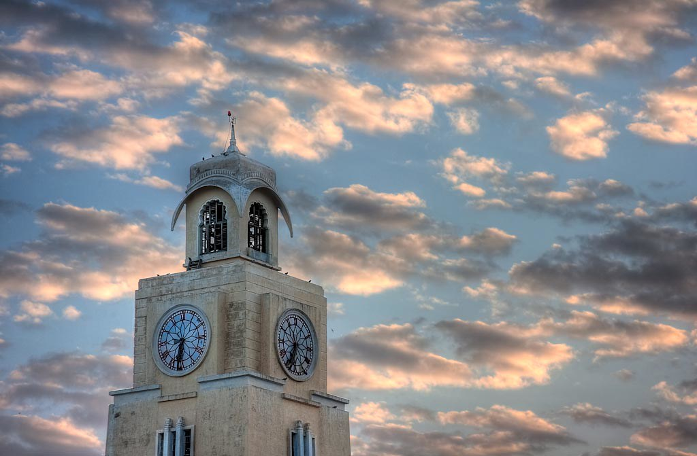

 
### Hello, I am Kanishk Vishwakarma
---
#### I am a Mechanical Engineering sophomore at [BITS Pilani](https://www.bits-pilani.ac.in/). I am also an Autonomous Robotics and Computer Vision researcher at [Sally Robotics](sally-robotics.co.in), [CEERI](https://www.ceeri.res.in/) and [Intelligent Mobility Labs](https://www.linkedin.com/company/intelligent-mobility-labs/)

   
 
Skills: ROS / C++ / Python / HTML / JavaScript

- 🔭 I’m currently working on making non-ROS computer vision code ROS compatible 
- 📫 How to reach me: [My website](http://kanishk598.github.io/) 

          

